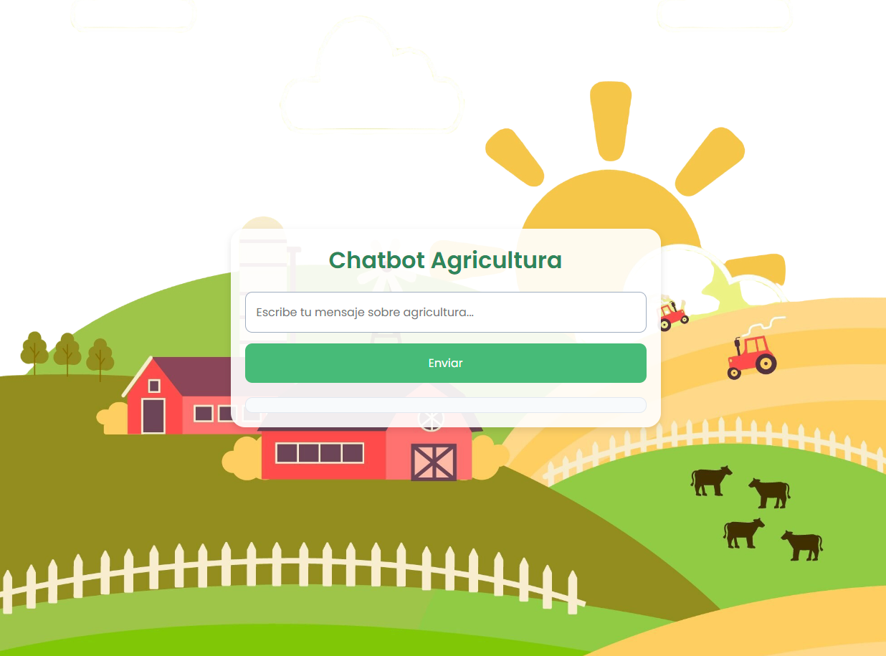

# Chatbot de Agricultura - Departamento de Antioquia


Este proyecto es un chatbot desarrollado para proporcionar respuestas a preguntas relacionadas con la agricultura, el mantenimiento y el cuidado de diferentes cultivos en el departamento de Antioquia, como banano, lechuga, aguacate, plátano, papa, entre otros. Fue inicialmente desarrollado en Google Collaboratory y luego desplegado en una aplicación Flask utilizando Visual Studio.

## Descripción del Proyecto

El chatbot utiliza un modelo de procesamiento de lenguaje natural (NLP) basado en BERT para comprender las preguntas de los usuarios y proporcionar respuestas relevantes. El dataset contiene preguntas y respuestas sobre agricultura en Antioquia y está diseñado para ayudar a los agricultores a obtener información útil sobre los cultivos.

### Características:

- Responde a preguntas sobre diferentes cultivos agrícolas.
- Responde a saludos de manera amigable.
- Utiliza técnicas de vectorización y clasificación de texto para identificar preguntas válidas y relevantes.
- Integra un modelo Naive Bayes para verificar la relevancia de las respuestas.

## Requisitos

- Python 3.7 o superior
- Flask 2.0 o superior
- pandas
- transformers
- sentence-transformers
- scikit-learn
- nltk
- flask-cors

### Instalación de Dependencias

Para instalar todas las dependencias necesarias, puedes ejecutar:

```
pip install pandas flask transformers sentence-transformers scikit-learn nltk flask-cors
```


## Dataset

El archivo `test4.csv` contiene la información estructurada en las siguientes columnas:

- **Pregunta**: Consulta relacionada con un cultivo o práctica agrícola.
- **Respuesta**: Respuesta correspondiente a cada pregunta.
- **Tag**: Etiquetas para categorizar las preguntas según el tipo de cultivo o tema agrícola.

## Estructura del Código

- **app.py**: Contiene la lógica principal del chatbot.
- **modelos**: Implementa un modelo de clasificación basado en BERT para la comprensión del lenguaje y un modelo Naive Bayes para validar la relevancia de las respuestas.
- **vectorización**: Las preguntas se vectorizan utilizando TF-IDF, eliminando palabras irrelevantes para mejorar la precisión de las respuestas.
- **Embeddings**: Compara preguntas y respuestas mediante embeddings generados con Sentence Transformers, calculando similitudes para identificar la mejor respuesta.

## Lógica del Chatbot



- **Saludo**: El chatbot responde de manera amigable si detecta un saludo en el mensaje del usuario.
- **Clasificación de Preguntas**: Si el input es una pregunta, se calcula su similitud con las preguntas en el dataset utilizando `cosine_similarity`.
- **Respuesta Predeterminada**: Si la pregunta no es válida o no se encuentra una respuesta relevante, el chatbot responde solicitando más información.

## Ejecución del Proyecto

1. Clona este repositorio en tu entorno local.
2. Asegúrate de que todas las dependencias están instaladas (consulta el archivo `requirements.txt` si está disponible).
3. Ejecuta la aplicación Flask desde Visual Studio Code o cualquier otro entorno de desarrollo local.


```
python app.py

El chatbot estará disponible en http://localhost:5001/chat y recibirá solicitudes POST con el formato:

{
    "message": "¿Cómo puedo cuidar mis plantas de banano?"
}
```

## Despliegue en Producción

Para desplegar este chatbot en un servidor de producción, sigue estos pasos:

1. **Configura un servidor**: Utiliza servicios como AWS, Heroku u otro proveedor de tu elección.
2. **Instala las dependencias**: Asegúrate de que todas las dependencias necesarias estén instaladas.
3. **Configura el entorno de producción**:
   - Establece un puerto de producción.
   - Cambia el modo `debug` a `False` en el archivo principal de Flask.
4. **Usa un servidor de aplicación**: Utiliza `gunicorn` o `uwsgi` para gestionar el despliegue de la aplicación Flask en un entorno de producción, asegurando un rendimiento óptimo.

## Colaboradores

Este proyecto fue desarrollado por un equipo de estudiantes del bootcamp de inteligencia artificial y talento tech, versión 2, de MINTIC.

### Estudiantes

- **Laura Sofía Luna Duque**
- **Edilberto Salazar García**
- **Christian Javier Uchima Sierra**
- **Adriana María Vélez**
- **Ismael Vasco**
